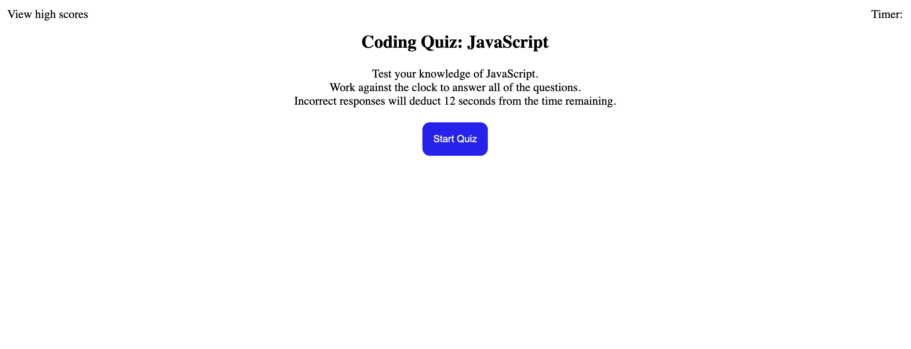

# Coding Quiz

## Description
The following application currently is in-development.  It is designed to help students of coding review fundamental JavaScript concepts.

## Features
When pressed, the start button advances to the first of five questions.

Features that have yet to be implemented include a countdown timer, a field in which the user can type their initials, and a page for displaying high scores.
https://raposamillar.github.io/coding-quiz/

